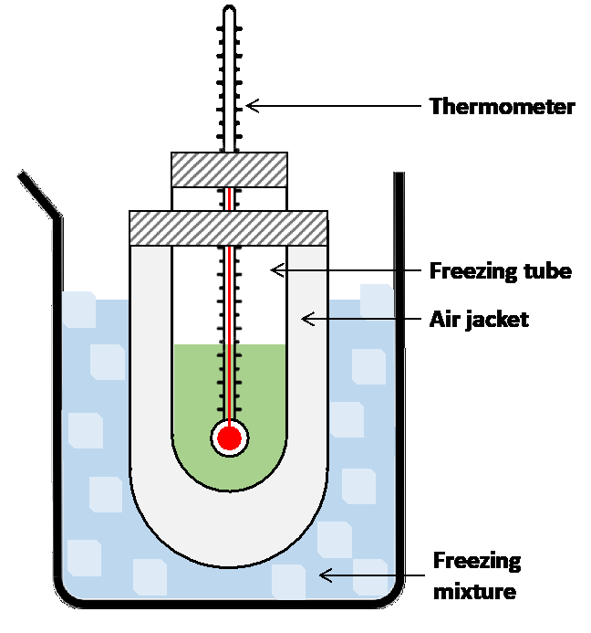
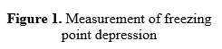

When some solute is added to a solvent, the freezing point of the resulting solution is found to be less than that of pure solvent. This is known as freezing point depression. It is a colligative property i.e. the extend of the dropping of the freezing point is proportional to the number of solute molecules present in the solution. 

The magnitude of the freezing-point depression (ΔTf) is directly proportional to the molality of the solution as  

∆Tf=Kf×molality                                                                    (1) 
 
 
 
where, Kf is a parameter called the freezing-point depression constant or cryoscopic constant and i is the van 't Hoff factor, the number of particles the solute splits into or forms when dissolved. This constant corresponds to the value of ΔTf when molality = 1, and is characteristic of the solvent. 

<b>Molality of a solution is given by:</b> 
molality=(moles of solute)/(Mass of the solvent in kg)&nbsp;&nbsp;&nbsp;&nbsp;&nbsp;&nbsp;&nbsp;&nbsp;&nbsp;&nbsp;&nbsp;&nbsp;&nbsp;(2) 

moles of solute=(weight of solute (w_solute))/(Molecular weight of solute (M))&nbsp;&nbsp;&nbsp;&nbsp;&nbsp;&nbsp;&nbsp;&nbsp;&nbsp;(3) 

mass of the solvent in kg=(mass of the solvent in gm(w_solvent))/1000&nbsp;&nbsp;&nbsp;&nbsp;&nbsp;&nbsp;&nbsp;&nbsp;&nbsp;&nbsp;&nbsp;(4)  

Now plugging all the information into equation (1), we finally get: 

M=(K_f×w_solute×1000)/(ΔT_f×w_solvent )	&nbsp;&nbsp;&nbsp;&nbsp;&nbsp;&nbsp;&nbsp;&nbsp;&nbsp;&nbsp;&nbsp;&nbsp; (5) 

Using equation (5) we can calculate the molecular weight of the solute provided a solution is prepared containing known masses of solute and solvent (wsolute and wsolvent), the measured freezing-point depression of the solution, and the value of kf for the solvent is known. This is a fairly common method for determining the molecular weights of non-volatile substances and it forms the basis for this experiment. We will dissolve an accurately weighed quantity of an unknown solute in an accurately weight quantity of solvent and measure the freezing-point depression for the resulting solution. Then, using the provided Kf value for solvent and equation (5), we will calculate the molecular weight of the unknown solute.

