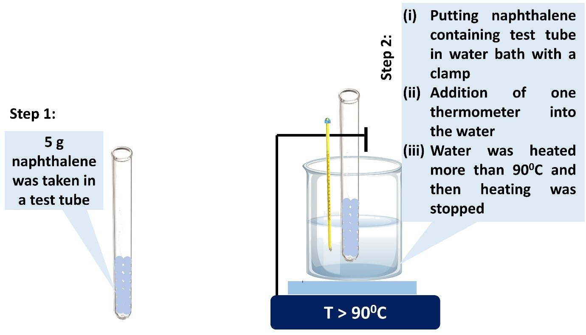
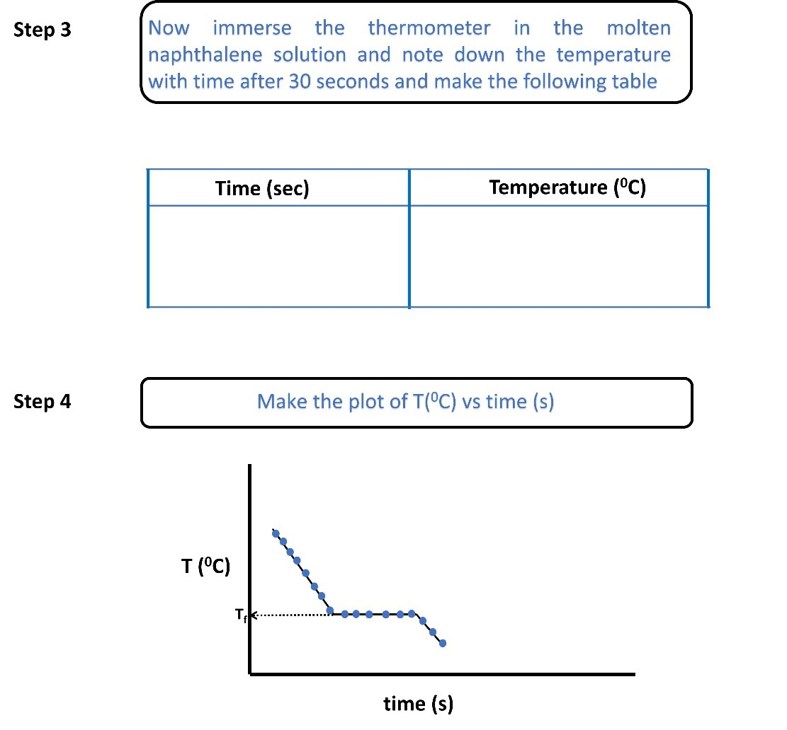
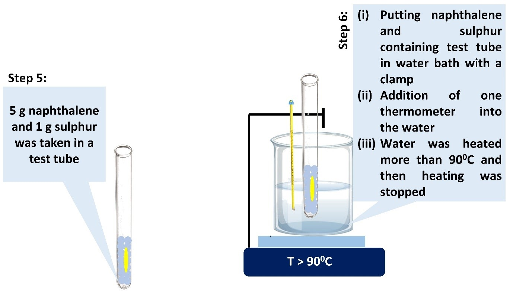
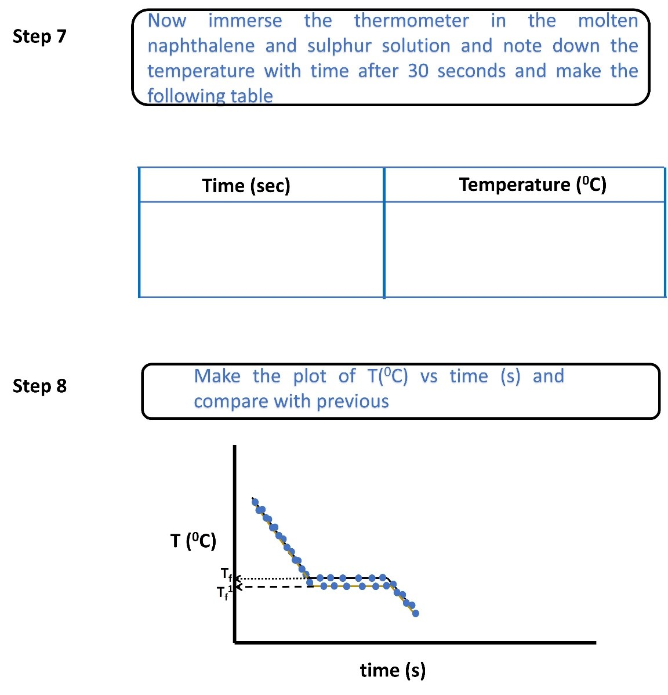
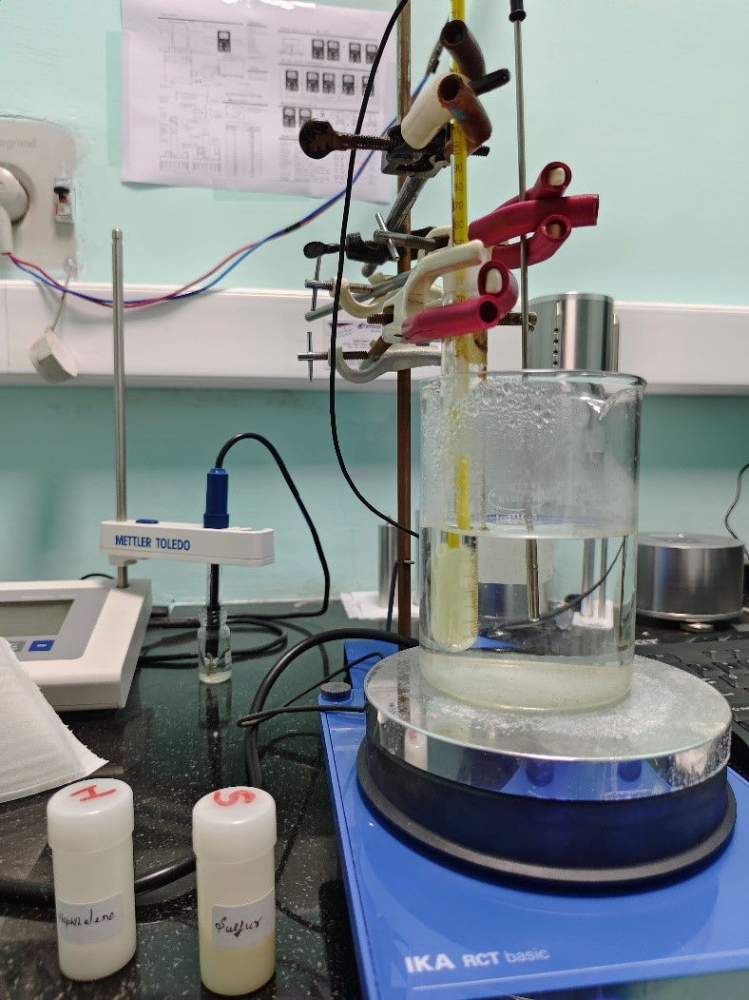
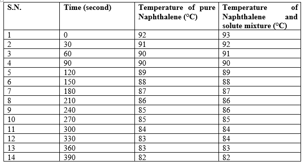
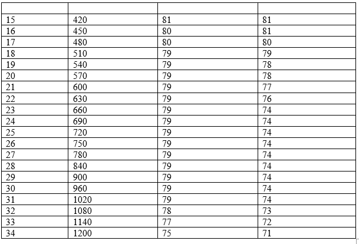
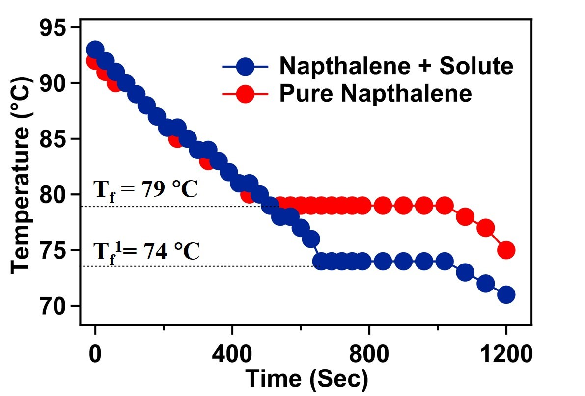

<b>Apparatus</b> 
 
A.	Temperature-controlled magnetic stirrer 
B.	Thermometer 
C.	Beaker (500 mL) 
D.	Test tube 
E.	Naphthalene  
F.	Sulfur powder  
G.	Clamp  
 
<b>Procedure in laboratory (diagram)</b> 
 
 
 
 
 
 
 
 
 
 
Depression of freezing point, 
<centre><b>∆Tf=-(Tf1-Tf)</b></centre> 
 
<b> Procedure in laboratory (diagram)</b> 
 
 
 
<centre><b>See the video!</b><centre>  
<b> Data and the analysis </b> 
<b> Determination of freezing point of pure naphthalene and naphthalene-solute mixture </b> 
 
 
 
 
 
<b>Calculation</b> 
 
 
<b>Figure 1.</b> Temperature vs time graph of pure naphthalene and naphthalene-solute mixture. 
 
The cryoscopic constant (K_f) of naphthalene is 6.9 °C/molality. From the experiment, we measured the depression in the freezing point (ΔT_f) of naphthalene after adding the unknown solute is 5 °C. For the experiment 5 gm (w_solvent)of naphthalene was taken and 1 gm (w_solute)of unknown solute was added in naphthalene.  According to equation 5, the molecular weight of the solute added in the naphthalene solvent will be 
M=Kf×wsolute×1000/ΔTf×w<b>solvent</b> 

M=(6.9×1×1000)/(5×5)=276 g mol(-1) 
 

<b> Procedure in simulator of the experiment</b> 
 
To be added based on the simulation

<b>Analysis</b> 
 
From the experiment, the molecular weight of the unknown solute is measured as 272 g/mol. In this experiment, rhombic sulphur (S8) was used as the unknown solute which has an actual mass of 256 g/mol.

